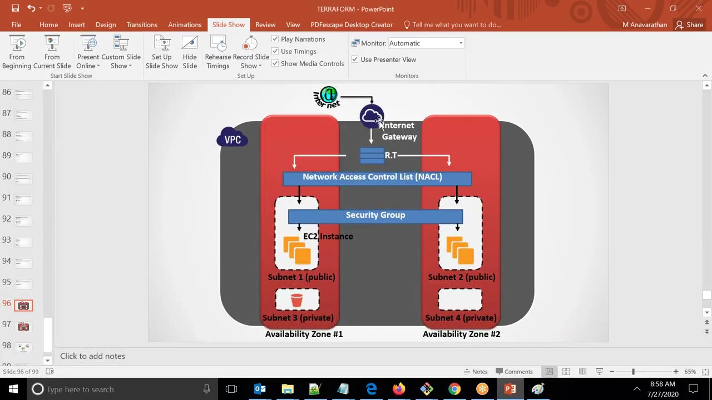

Sample Terraform Project 01
--------------------------------------------
### Architecture-01 


### Step1
- Installation of Terraform on Linux Ubuntu Machine
```
$mkdir Terraform-Project-01
$cd Terraform-Project-01 
$ curl -O https://releases.hashicorp.com/terraform/0.11.0/terraform_0.11.0_linux_amd64.zip
$ apt install -y unzip
$ unzip terraform_0.11.0_linux_amd64.zip -d /usr/local/bin/
$ terraform version
 ```
- Export your AWS access key and secret key
```
$export AWS_ACCESS_KEY_ID= (your access key id)
$export AWS_SECRET_ACCESS_KEY= (your secret access key)

```
### Step2 
- Create VPC on ap-south-1 region
- Create subnets
- Create Internet gateway 
- Create Route table
- Associate the RouteTable to the Subnet 


```
terraform init
terraform validate
terraform apply --auto-approve
```
- Please goto AWS Console and verify ,It's created or not
### Architecture-02


